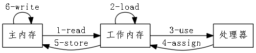

# Java内存模型

- 目标:为了屏蔽各种硬件和操作系统的差异，实现Java在各种平台下都能达成一致的内存访问效果（程序的执行结果是正确的）
- 基本实现方式：定义程序中各个变量(此处的变量指可被多线程访问的资源，方法参数和局部变量因属于线程私有不在此范围)的访问规则。
## java 内存模型定义
### 1. 主内存和工作内存
java内存概念模型中的概念，可以类比为操作系统里的主存和寄存器的概念。主内存是概念上的东西，这里的内存可以理解为机器内存，与Java里的堆栈没有关系。工作内存是指在Java线程直接作用的内存。  
Java中，变量创建在主存中进行，其后对主存变量中的任何修改需要通过工作内存完成，工作内存从主存中读取变量，然后把执行的结果回写到主存。
### 2. 内存交互操作
Java中对内存的操作分为8种，分别为read,load ,use ,assign,store,write ,lock ,unlock。图片展示了这八种操作各自作用的对象以及读写一个变量时八种操作的执行顺序

图1 Java内存操作

### 3. volatile关键字

特性：  
1. 读取变量时，保证从主内存读取。更新变量时，保证更新的值立即回写到主内存。     
volitile关键字保证了在读取变量的值时,通过同步read,load,use三个操作完成读取变量时，取主内存中的值，而不是工作内存中的值。
在写变量时，通过同步asssign,store,write三个操作完成当变量值发生变化时，立即回写到内存。  
但是volatile的这种特性并不能完全的保证变量的值是同步的，原因在于use和assign这两个指令不是同步的。当线程执行到use指令时完全有可能被其他线程抢去CPU。这也是volatile变量在依赖自身值(i++)或者其他变量时，不能保证同步的原因。   
2. 禁止指令重排序

### 4.先行发生原则

