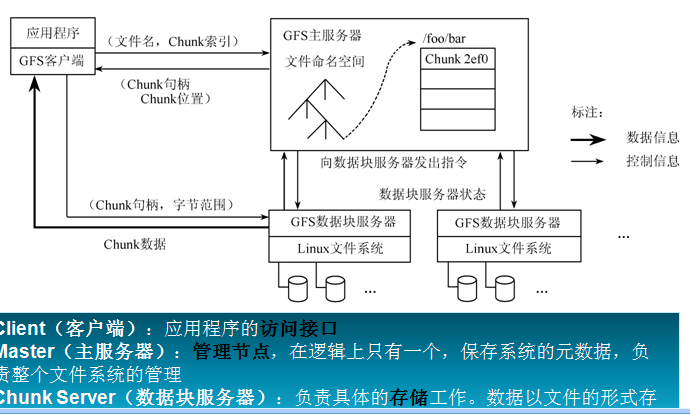

# GFS系统
## 1 GFS系统模型
  GFS是一个分布式的文件系统，做为一个文件系统，其需要支持文件的增删查改以及快速定位文件的位置，校验文件内容的功能！分布式文件系统与传统的文件系统的区别在于分布式文件系统能够协同多台计算机存储一个较大的文件，文件的大小不受单个机器存储空间的限制。文件在传统的文件系统其只能在一台机器上存储，文件的大小受到机器存储容量的限制！综合以上，分布式文件系统的功能主要由，文件名称管理，文件读写，文件内容正确性检测，并发控制，高可用性，安全性。

### 1.1 GFS的系统架构

  GFS中的角色由master,chunkServer和clent三部分组成，master主要负责整个系统的目录，文件维护和clent和chunkServer的交互。chunkServer主要保存文件中的数据，数据备份，与clent进行数据交互，与master保持信息交互。clent是客户端，主要功能为读写文件。
  
### 1.2 GFS的目录和锁

### 1.3 GFS的一致性模型
### 1.4 GFS的容错机制

## 2 GFS读取文件过程
   - 读取文件的场景
   - clent 读取文件的过程
## GFS写文件过程
## GFS快照